# Week 1

## Unix Command Line

- #### Shell

- Program yang berbasis tulisan digunakan untuk berkomunikasi atau memerintah sistem pada komputer
- User interface yang bertugas untuk memproses semua perintah yang diketik di CLI

- #### Command Line Interface

Jenis shell yang berbasis teks dapat memberikan intruksi pada komputer

- #### Cara mengakses CLI dan menggunakan terminal

1. ketik cmd pada search windows
2. windows+r(run) lalu ketik cmd
3. klik kanan pada repositori/folder lalu klik git bush
4. pada visual studio code menggunakan key shortcut ctrl+`

- #### File System Structure

Sistem operasi windows dan linux menyusun file dan direktori/folder menggunakan struktur yang bentuknya mirip tree

- #### Command command pada CLI atau Git bush

1. Command cd
   cd = pindah folder
   cd ../ = pindah ke direktori sebelumnya
   cd folder/

2. Command pwd
   untuk mengetahui lokasi sekarang

3. Command mkdir
   untuk membuat folder baru

4. Command touch
   untuk membuat file baru

5. Command nano
   untuk membuka dan edit file

6. Command ls
   untuk melihat isi folder

7. Command cat
   untuk melihat isi file

8. Command head
   untuk melihat beberapa isi seperti bagian atas dari file

9. Command tail
   Untuk melihat beberapa baris isi bagian dari file

10. Command mv
    Untuk menghapus file dan rename file atau direktori

11. Command rm
    Untuk menghapus file atau direktori

12. Command cp
    Untuk mengcopy files atau direktori

## Git dan Github

### Git

- Tools
- Version control system
- Mencatat setiap perubahan pada file
- Aplikasi yang dapat melacak setiap perubahan yang terjadi pada suatu folder
- Dengan menggunakan Git dan Github dapat berguna untuk bisa bekerja sama dalam tim / berkolaborasi

### Command Git

- git init . ==> digunakan untuk membuat repository di file lokal
- git status ==> digunakan untuk mengetahui status repository lokal
- git add . ==> digunakan untuk menambah file baru di repository yang dipilih
- git commit -m "message" ==> save perubahan pada version control

## HTML dan CSS

### HTML

- HTML atau Hyper Text Markup Language adalah markup langauage yang digunakan untuk membentu kerangka pada website

- HTML bukan bahasa pemrograman karena HTML tidak bisa memanipulasi data

- HTML dapat dibuat dibuat dengan dengan Notepad,Sublime text,VS code .Namun,text editor yang lebih populer adalah VS code
  karena VS code memiliki extension dan fitur yang dapat memudahkan developer

- Dibutuhkan browser untuk menampilkan hasil code pada html

- Berikut contoh HTML yang sederhana

      <!DOCTYPE html>
      <html>
      <head>
      <title>Page Title</title>
      </head>
      <body>

      <h1>My First Heading</h1>
      
My first paragraph.

      </body>
      </html>

- Untuk menjalakan HTML secara manual dilakukan tahap tahap seperti

1. Membuat folder untuk file html
2. Membuat file di dalam folder yang baru saja dibuat
3. Menuliskan code dasar pada html di text editor
4. Buka di browser dengan cara pergi ke folder dan buka file html tadi dengan browser yang diingkan pada klik kanan file html
5. file html pun terbuka pada browser
6. Untuk edit kembali code,file di save terlebih dahulu dan refresh browser maka tampilan berubah

- Untuk menjalankan HTML dengan menggunakan live server

1. Membuat folder untuk file html
2. Membuat file di dalam folder yang baru saja dibuat
3. Ketik cmd pada bagian address file di bagian atas dan masuk ke CLI
4. Ketik code . dan vs code terbuka sesuai folder dan file tadi
5. Ketik code dasar pada html
6. Install live server di bagian extensions pada vs code
7. Buka browser dengan klik kanan pada file html di text editor dan buka open with live server
8. Maka file html tampil pada browser
9. Untuk edit kembali code,file di save terlebih dahulu dan tidak perlu refresh browser maka tampilan berubah langsung ketika file sudah disave

- #### Semantic HTML

- Menggunakan element html yang sesuai dengan kebutuhan konten
- Digunakan agar lebih mudah baca dan dimengerti
- contoh : tag header,nav,section,aside,article,footer,main

- #### Tag HTML yang populer atau sering digunakan

tag head,body,nav,section,footer,table,tr,td,h1,h2,h3,p,link,form,input,dll

- #### Mendeploy html

1. Menggunakan tool bernama Netlify
2. Masuk ke netlify.com lalu register seperti biasa menggunakan email atau github
3. Masuk ke tab Sites lalu drag and drop seluruh folder html kalian
4. File html berhasil di deploy

### CSS

CSS atau Cascading Style Sheets adalah bahasa yang digunakan untuk mendesain halaman website.Dengan CSS, kita bisa mengubah warna, menggunakan font custom, editing text format, mengatur tata letak, dan lainnya.

CSS sama seperti HTML bukan merupakan bahasa pemrograman karena tidak bisa memanipulasi data

- #### Cara Menyisipkan CSS ke dalam HTML

1. Inline Style
   Inline styles adalah kita menambahkan CSS pada attribute element HTML

   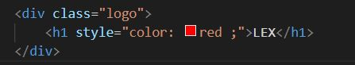

2. .CSS files
   Jika kita membutuhkan banyak code pada CSS, direkomendasikan untuk memisahkan code CSS di file tersendiri (extension .css) dan terpisah dari file HTML.

   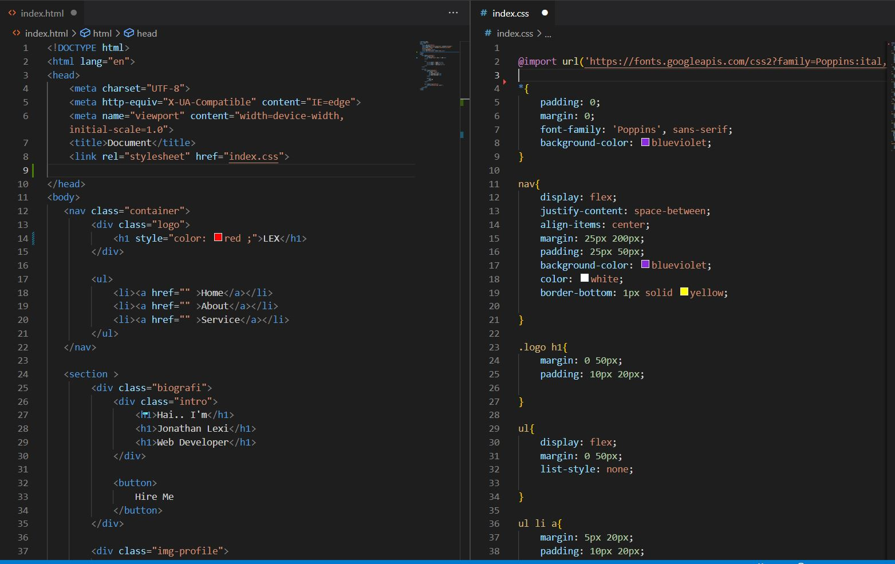

3.  tag

   menggunakan tag <style> di html

   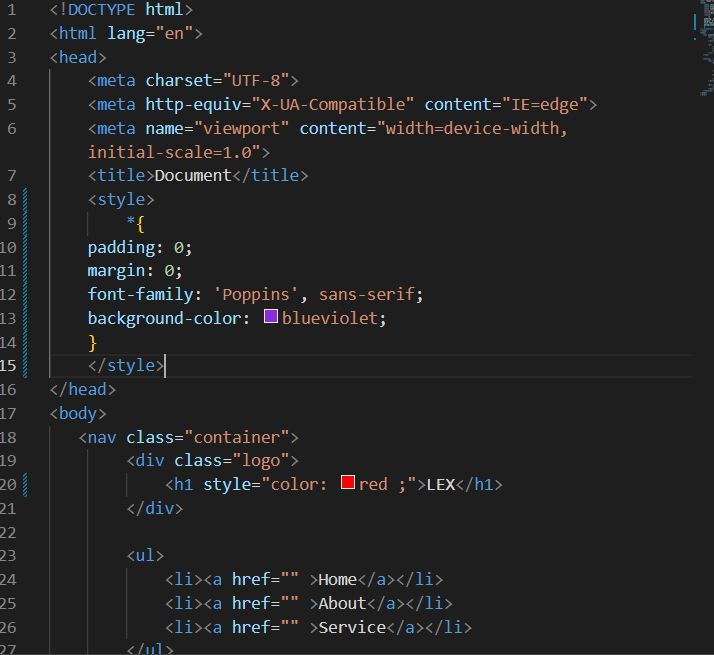

- #### Styling CSS pada halaman html

1. CSS Tag name
   Menggunakan tag elemen HTML secara langsung pada CSS dan akan mempengaruhi seluruh tag elemen html yang ada pada file tersebut

   

2. Gunakan (.) saat memanggil class pada CSS

   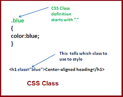

3. Dapat menggunakan lebih dari 1 class untuk 1 element html

4. CSS ID Name hanya ada 1 nama id di 1 element html.Gunakan (#namaID) saat memanggil element ID HTML pada CSS

   

5. Setiap element pada CSS memiliki parent and child

   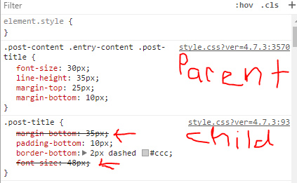

6. Multiple selector
   Membuat code lebih efisien dan tidak repetitive (melakukan hal yang sama berulang kali)

   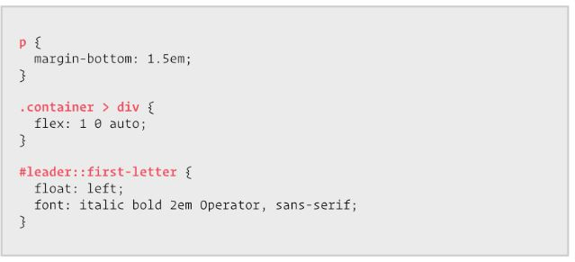

7. Psudo classes dan elements

   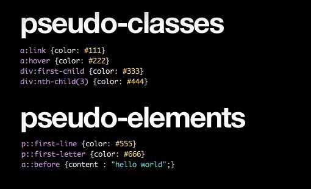

   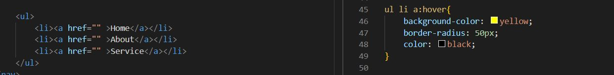

- #### Responsive Web Design CSS
  Desain web yang responsif dapat membuat halaman web terlihat bagus di semua perangkat. Desain web responsif hanya menggunakan HTML dan CSS.

Tag meta pada html untuk membuat responsive website

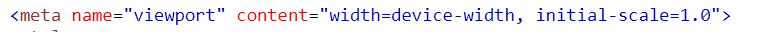

mengatur tampilan dengan ukuran layar tentu

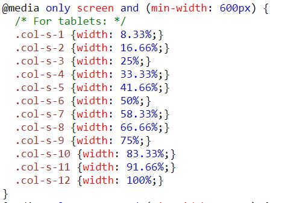

- #### Flexbox CSS

  Untuk mulai menggunakan model Flexbox, Anda harus mendefinisikan wadah flex terlebih dahulu.

  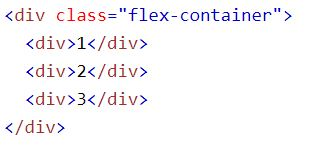

##### Properti flex container

- display
  Membuat container yang kita punya menjadi flex dan dapat memakai property flex.
- flex-direction
  Dapat menentukan arahnya item-item yang ada didalam container.
  - Row (default) : item akan berurutan dari kiri ke kanan
  - Row-reverse : kebalikan dari row, item berurutan dari kanan ke kiri
  - Column : sama seperti row, tetapi akan berurutan dari atas ke bawah
  - Column-reverse : sama seperti row-reverse. Tetapi berurutan dari bawah ke atas
- flex-wrap
  Membuat item yang berlebihan untuk lanjut ke baris atau kolom berikutnya
- justify-content
  Property ini memungkinkan kita mengkontrol atas penyelarasan (alignment) item flex yang berada di dalam container.
  - Flex- start: posisi item akan dikemas pada bagian awal “flex-direction”
  - Flex-end: posisi item akan dikemas pada bagian akhir “flex-direction”
  - Center: posisi item akan dikemas ke bagian tengah baris
  - Space-between: letak item akan didistribusikan secara merata, item pertama ada pada bagian start dan item terakhir pada bagian end.
  - Space-around: letak item akan didistribusikan secara merata dengan space/ruang yang ada diantara item.
- align-items
  digunakan untuk menyelaraskan item fleksibel

  - center : menyelaraskan item di tengah wadah
  - flex-start : menyelaraskan item di atas wadah
  - flex-end : menyelaraskan item di bawah wadah
  - stretch : meregangkan item untuk menisi wadah

- align-content
  Memodifikasi perilaku properti flex-wrap. Hal ini mirip dengan align-item, tapi bukannya menyelaraskan flex item, tetapi menyelaraskan garis flex
  align-content: stretch|center|flex-start|flex-end|space-between|space-around|space-evenly|initial|inherit;

## Algoritma dan Data Structures

Algoritma adalah langkah langkah dalam menyelesaikan suatu masalah

Programming identik dengan penyelesaian suatu masalah maka dari itu berhubungan dengan algoritma dan data struktur

Algoritma akan menyelesaikan suatu permasalahan menggunakan data yang sudah di olah oleh data struktur

Data struktur digunakan untuk mengola sebuah data

Dengan algoritma dapat berpikir secara terstruktur

#### Ciri Ciri Algoritma

- Input dan output harus didefinisikan terlebih dahulu dengan tepat
- Setiap step harus benar-benar clear dan tidak ambigu
- Algoritma seharusnya tidak mengandung suatu code pada bahasa pemograman tertentu. Algoritma harus dibuat agar dapat digunakan dalam bahasa pemograman apapun.
- Memiliki titik berhenti
- Sebisa mungkin tepat sasaran dan efisien

#### Jenis Proses Algoritma

1. Sequence = intruksi yang dijalankan secara berurutan
   line by line

   Penerapan dalam kehidupan sehari hari
   Resep makanan

   Penerapan dalam code

   let a = 0
   let b = 5
   let c = 0

   c = a + b

   console.log(c)

2. Selection / percabangan = intruksi yang dijalankan jika memenuhi sesuatu
   contoh penerapan : logika sederhana (jika maka)

- if...else...

- switch...case...

default = tidak memenuhi segala kondisi

3. Repeation / looping / perulangan

##### 3 aspek dalam perulangan

- iniator / loop initiation
- condition / loop conditions
- loop eksekutor (iterator)

- for... (fixed loop)

- while...do... (perulangan yang di cek dulu lalu di eksekusi)

- do...while... (perulangan yang di eksekusi lalu di cek)

##### Penyajian algoritma

- Deskriptif = tulisan
- Flowchart = diagram
- Pseudocode = kode pemrograman sederhana

## Javascript

- Javascript adalah bahasa pemograman yang sangat powerful yang digunakan untuk logic pada sebuah website
- Javascript juga dapat membuat website menjadi interaktif dan dinamis

#### Tipe Data pada Javascript

- Tipe data
- String
- Number
- Boolean (true or false)
- Undefined
- Object
- Null
- Symbol

#### Operator-operator

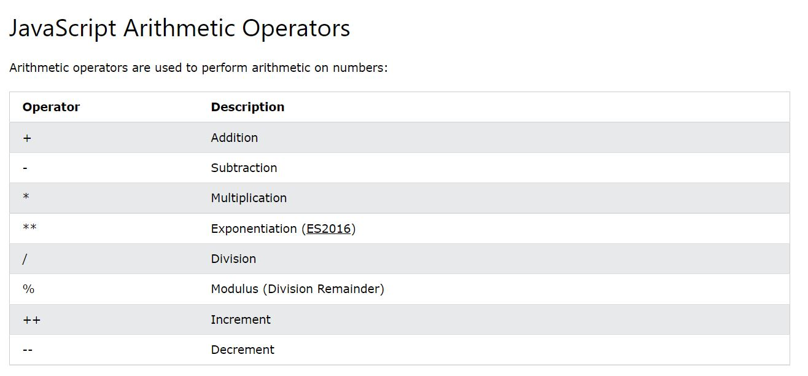

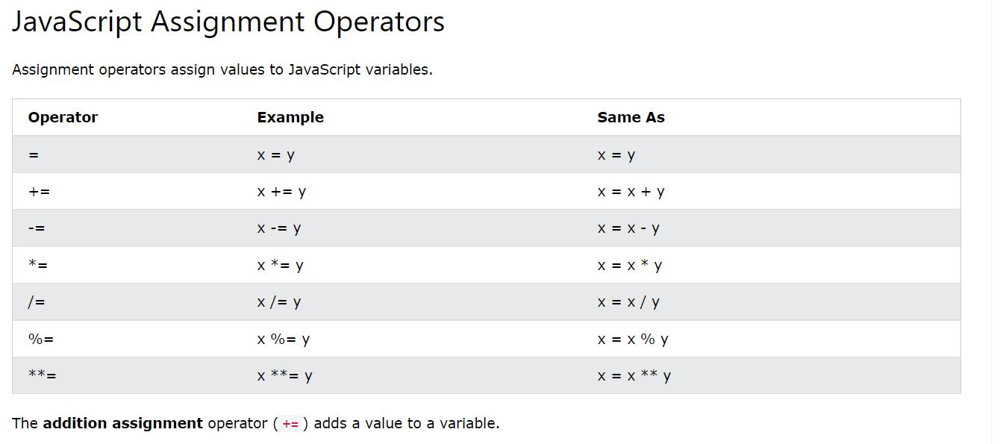

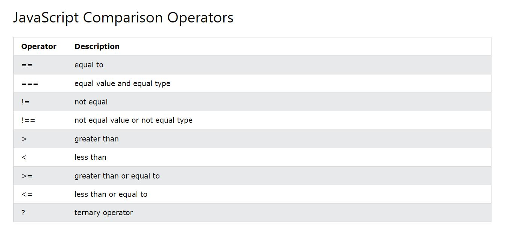

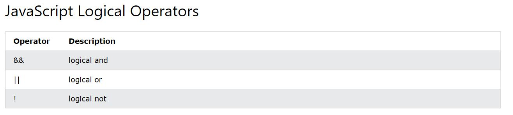

#### Variable

- Var
- Let
- Const

perbedaan let dan const
nilai variable pada let dapat diubah sementara const tidak dapat diubah

### JS Dasar Conditional

- Conditional merupakan statement percabangan yang menggambarkan suatu kondisi.
- Conditional statement akan mengecek kondisi spesifik dan menjalankan perintah berdasarkan kondisi tersebut
- Yang dicek adalah apakah kondisi tersebut TRUE (benar).Jika TRUE maka code didalam kondisi tersebut dijalankan.

##### 1. If Statement

if(kondisi){
//eksekusi jika dalam keadaan benar
}

##### 2. If... Else Statement

Else akan mengeksekusi sebuah statement/code jika suatu kondisi bernilai FALSE

if(kondisi){
//eksekusi jika dalam keadaan benar
}else{
//dalam keadaan salah
}

##### 3. If... Else If... Statement

if(kondisi1){
//eksekusi jika kondisi1 dalam keadaan benar
}else if(kondisi2){
//eksekusi jika kondisi2 dalam keadaan benar
}

##### 4. Switch Case Conditional

Gunakan switch case jika kondisi dan percabangan terlalu banyak

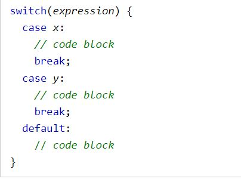

##### 5. Ternery operator (Conditional Statment)

- sifat sama seperti if else
- tidak cocok untuk mengecek banyak kondisi
- untuk kondisi sederhana

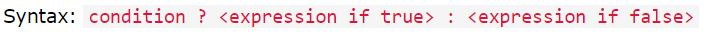

### JS Dasar Looping

Looping adalah statement yang mengulang sebuah instruksi hingga kondisi terpenuhi atau jika kondisi stop/berhenti tercapai.

##### 1. For Loop

Gunakan FOR LOOP jika kita tahu seberapa banyak nilai pasti untuk pengulangannya

- FOR LOOP PARAMETER

  - Inisialisasi: Sebagai inisialisasi awal dari mana mulainya sebuah pengulangan. Kita memberikan nilai awal/default pada parameter ini
  - Condition: For loop akan terus berjalan selama kondisi ini terpenuhi. Selama kondisi bernilai TRUE.
  - Post-expression (Increment/Decrement): Iterasi statement yang digunakan untuk mengupdate variabel yang menjadi kontrol pada pengulangan

    ##### 2. While Loop

    Gunakan WHILE LOOP jika kita tidak mengetahui jumlah pasti pengulangan.

    ##### 3. Do While Loop

  Terkadang kita ingin setidaknya menjalankan pengulangan 1 kali sebelum dilakukan pengecekan kondisi

  ##### 4. Nested Loop

Jika kita membuat looping didalam looping.

### JS Dasar Function

Function adalah sebuah blok kode dalam sebuah grup untuk menyelesaikan 1 task/1 fitur.Saat kita membutuhkan fitur tersebut nantinya, kita bisa kembali menggunakannya.

#### Local Scope vs Global Scope

- Global scope adalah variable yang kita buat dapat diakses dimanapun dalam suatu file
- Dideklarasi di luar blocks

- Local scope adalah mendeklarasikan variable didalam blocks
- Variable hanya bisa diakses didalam blocks saja

#### Membuat Function

### Memanggil Function

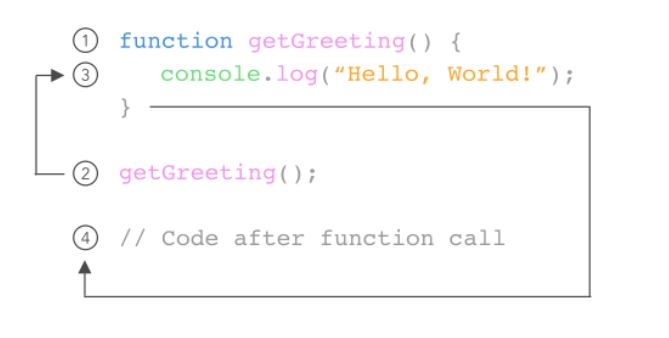

### Parameter dan Argumen

Parameter,menerima sebuah inputan data dan menggunakannya untuk melakukan task/tugas.

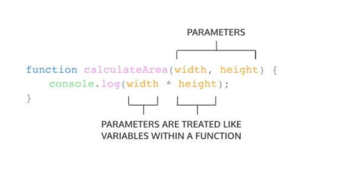

Argumen , nilai yang digunakan saat memanggil function

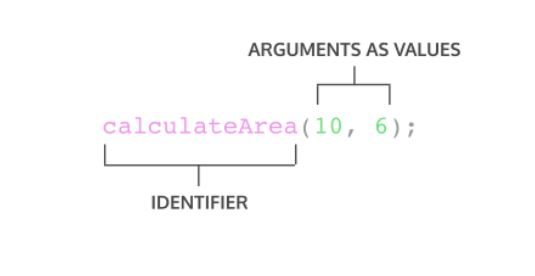
