# Week 2

## Tipe data dan Method

### String

- Memanipulasi huruf atau data tekstual
- " " atau ' '

### Method pada String

- toUpperCase()
  Mengubah huruf menjadi huruf kapital

- toLowerCase()
  Mengubah huruf menjadi huruf kecil

- includes()
  Mengembalikan nilai true jika string menggunakan string tertentu

- charAt() atau namavariablestring[]
  Mengambil string sesuai nilai index

- length
  Cek panjang string

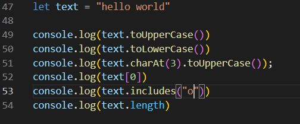

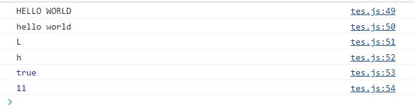

### Number

- Menyimpan angka tanpa desimal
- Menyimpan angka dengan desimal
- Eksponen
- Bilangan negatif
- angka spesial (infinity,NaN)

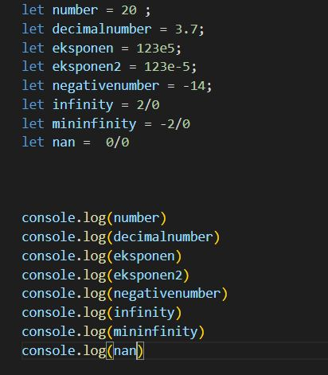

### Method pada Number

- toString()
  Mengubah tipe data number menjadi string
  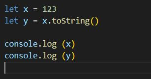

  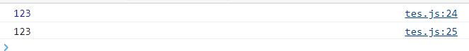

- toFixed()
  Membuat berapa angka dibelakang koma dan menjadi string

  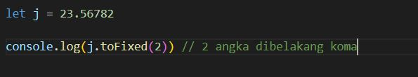

  

- isNaN()
  not a number method

  true jika nilai bersifat NaN dan tipenya angka

  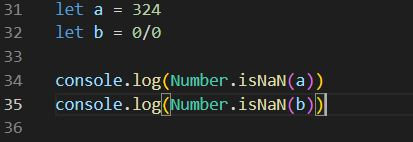

  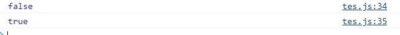

- Math.abs()
  Membuat angka menjadi tanpa negative atau absolut

  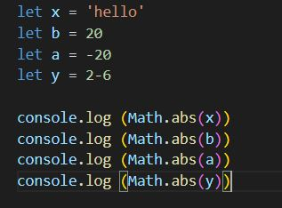

  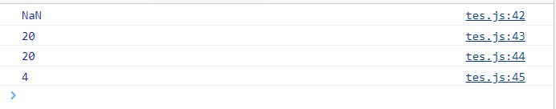

### Boolean

Hanya memiliki 2 nilai logika yaitu false dan true

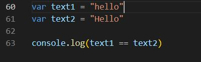

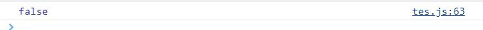

### Undefined

Variable dideklarasi tetapi tidak memiliki nilai

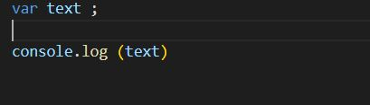

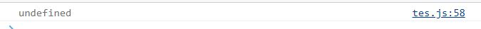

### Primitive

- Sudah ditentukan sebelumnya
- String, Number, BigInt, Boolean, undefined, null, dan Symbol.

### Non primitive

- Tipe data non-primitif diantaranya Array, Object, Map, Set, WeakMap, WeakSet, Date dan sebagainya, semuanya adalah Object.

## DOM

- Document object model
- Membuat website menjadi lebih dinamis
- Sebagai jembatan agar dokumen html dapat berinteraksi dengan bahasa pemrograman (javascript)
- Dapat memanipulasi element html

### Traversing elements

- mengambil element pada html

1. getElementById
   mengambil element id

2. getElementsByClassName
   mengambil element dengan nama class

3. getElementsByTagName
   mengambil element dengan nama tag

4. querySelector
   mengambil satu element html

5. querySelectorAll
   mengambil banyak element html

6. children
   mengambil element child

7. parentElement
   mengambil element parent

8. closest()
   mencari dan mengambil element dibagian atas dom tree

9. nextElementSibling
   mengambil element selanjutnya di bagian tree level yang sama

10. previousELementSibling
    mengambil element sebelumnya di bagian tree level yang sama

### Element vs node

- element
- hanya memiliki HTML element

- node
- setiap bagian terkecil di HTML

### DOM Manipulation

- innerHTML = mengambil nilai dari element pada HTML
- innertext = mengubah nilai menjadi string
- documen.createElement = membuat element baru
- append() = method untuk menambahkan child ke dalam parent
- appendChild() = tidak bisa membaca nilai text/string hanya menyisipkan node saja
- remove() = menghapus element/node

### HTML DOM Element style

- element.style.color
- element.style.border
- element.style.padding
- element.style.backgddroundColor
- element.style.removeProperty()

### DOM Events

- membuat web dapat menangkap interaksi user

- Element.addEventListener("event")
- Element.onevent
- EventListener-click
- EventListener-blur
- EventListener-form submission
